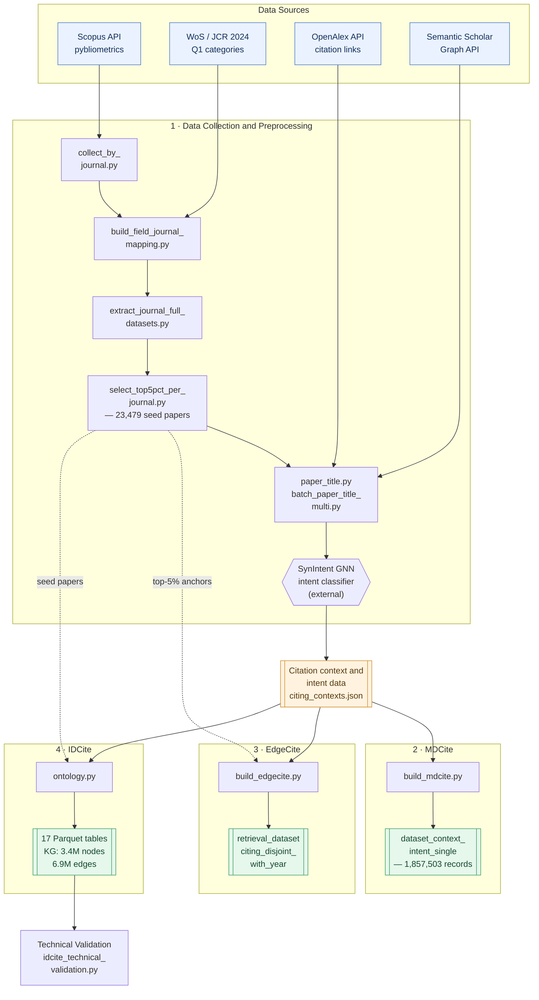

# IDCite

 **IDCite** is a large-scale multidisciplinary dataset of citation contexts and citation intents spanning 21 Essential Science Indicators (ESI) fields.

The dataset contains 1,857,503 citation records linking 1,467,045 citing papers and 23,479 seed papers, enriched with citation contexts, citation-intent annotations, publication metadata, and normalized scholarly entities.

This repository contains the complete pipeline for metadata collection, citation harvesting, citation-context integration, citation-intent annotation, entity normalization, dataset generation.

---

## Dataset Construction Pipeline 

From raw scholarly sources, a single preprocessing pipeline produces the shared
**Citation context & intent data**, which three downstream pipelines turn into
the **MDCite(v1)**, **EdgeCite(v2)**, and **IDCite(v3)** releases.



---

## Overview

- **Citation events:** 1,857,503
- **Citing papers:** 1,467,045
- **Seed (cited) papers:** 23,479
- **ESI fields:** 21
- **Representative WoS categories:** 21
- **Q1 journals:** 105
- **Citation intent labels:** 31 observed (30 valid; 7 canonical)
- **Supplementary knowledge graph:** 3,418,433 nodes / 6,855,117 edges
- **Data snapshot:** collected November 2025

IDCite preserves the scale, imbalance, and disciplinary heterogeneity of
real-world scholarly citations across the life sciences, medicine, engineering,
physical sciences, social sciences, humanities, and multidisciplinary domains.

---

## Code Structure

```
code/
├── 1_Data_Collection_Preprocessing/   # raw → Citation context & intent data
│   ├── collect_by_journal.py
│   ├── build_field_journal_mapping.py
│   ├── extract_journal_full_datasets.py
│   ├── select_top5pct_per_journal.py
│   ├── paper_title.py
│   └── batch_paper_title_multi.py
├── 2_MDCite_Construction/             # → dataset_context_intent_single
│   └── build_mdcite.py
├── 3_EdgeCite_Construction/           # → retrieval_dataset_citing_disjoint_with_year
│   └── build_edgecite.py
├── 4_IDCite_Construction/             # → 17 IDCite Parquet tables
│   └── ontology.py
├── Technical Validation/
│   └── idcite_technical_validation.py
└── requirements.txt

README.md
```

### Construction pipelines

The code is organized into four self-contained construction pipelines that
reproduce the successive Zenodo releases from the raw inputs. Each folder has
its own README.

| # | Pipeline | Input → Output | Key script |
| --- | --- | --- | --- |
| 1 | Data Collection & Preprocessing | Scopus records → **Citation context & intent data** | `batch_paper_title_multi.py` |
| 2 | MDCite Construction | Citation context & intent data → **`dataset_context_intent_single`** | `build_mdcite.py` |
| 3 | EdgeCite Construction | Citation contexts + top-5% anchors → **`retrieval_dataset_citing_disjoint_with_year`** | `build_edgecite.py` |
| 4 | IDCite Construction | Seed papers + citation contexts → **17 IDCite Parquet tables** | `ontology.py` |

---

## Data Sources

IDCite is constructed by integrating multiple large-scale scholarly data
sources:

### Scopus bibliographic records
Bibliographic metadata are collected via the **Scopus API** (using
`pybliometrics`), providing journal articles, citation counts, and rich
publication metadata. These records are used to identify influential seed
papers based on journal-stratified citation statistics.

### Web of Science (WoS) 2024 Subject Categories (JCR)
WoS subject categories are used to group journals by scientific field and to
select **Top-5 Q1 journals per representative category** (105 journals across
21 categories), enabling journal-stratified, field-aware sampling.

### OpenAlex API
The **OpenAlex API** is used for DOI resolution and large-scale citation-link
retrieval (i.e., identifying papers that cite the selected seed papers).

### Semantic Scholar Graph API
The **Semantic Scholar Graph API** is used to retrieve citation context spans
associated with each citing paper. Citation
contexts correspond to textual spans surrounding in-text citation markers.

---

## Construction Pipeline

IDCite is built through a transparent and reproducible pipeline:

1. **Seed paper acquisition & journal-stratified sampling**
   - Journals grouped by WoS subject categories (21 categories × 5 journals)
   - Top 5% most-cited papers retained independently within each journal
   - Produces 23,479 multidisciplinary seed papers

2. **Bibliographic metadata collection**
   - Metadata harmonized across Scopus, OpenAlex, and Semantic Scholar

3. **Citation-event extraction**
   - Each citing publication is linked to a referenced seed paper as a directed
     citation event, preserving citation contexts and provenance

4. **Semantic citation intent annotation**
   - Citation events are annotated with citation intents using a graph neural
     network-based citation intent classification framework (weak supervision)

5. **Entity normalization & DOI processing**
   - Normalized identifiers for authors, affiliations, journals, cities,
     countries, fields, and citation intents

6. **Supplementary ontology-ready knowledge graph construction**
   - Heterogeneous nodes and typed edges (3,418,433 nodes / 6,855,117 edges),
     provided as a supplementary resource

7. **Release**
   - Structured Apache Parquet tables for citation events, publication
     metadata, normalized entities, and the knowledge graph

---

## Code Description

### 1 · Data Collection & Preprocessing (`code/1_Data_Collection_Preprocessing/`)

Produces the **Citation context & intent data** from raw Scopus records.
See the [folder README](code/1_Data_Collection_Preprocessing/README.md).

- `collect_by_journal.py` — collects journal-level bibliographic metadata via
  the **Scopus API** (per journal / year range).
- `build_field_journal_mapping.py` — matches journals to WoS field/category
  groups and builds a merged field/journal table.
- `extract_journal_full_datasets.py` — splits the merged table into
  per-journal full datasets.
- `select_top5pct_per_journal.py` — journal-stratified Top-5% seed-paper
  selection.
- `paper_title.py` — citation-context extraction engine (**OpenAlex** citation
  links + **Semantic Scholar Graph API** contexts).
- `batch_paper_title_multi.py` — batch driver producing
  `output_<field>/<doi>/citing_contexts.json`.

Citation **intents** are assigned by running the SynIntent model
(Phan et al., IP&M 2026) over the retrieved contexts; that external model is
not redistributed here (see the folder README).

### 2 · MDCite Construction (`code/2_MDCite_Construction/`)

- `build_mdcite.py` — parses the citation contexts into the MDCite schema and
  keeps single (non-composite) intents, producing
  `dataset_context_intent_single.{parquet,csv}` (plus the multi-intent
  provenance table). See the [folder README](code/2_MDCite_Construction/README.md).

### 3 · EdgeCite Construction (`code/3_EdgeCite_Construction/`)

- `build_edgecite.py` — reorganizes the citation contexts into a
  citation-event retrieval benchmark with normalized cited anchors,
  title-based candidates, a citing-disjoint train/validation/test split, and
  year metadata, producing
  `retrieval_dataset_citing_disjoint_with_year.parquet`. See the
  [folder README](code/3_EdgeCite_Construction/README.md).

### 4 · IDCite Construction (`code/4_IDCite_Construction/`)

- `ontology.py` — builds the ontology-ready IDCite resource: citation-event
  records, citing-/seed-paper tables, normalized entity lookup tables, and the
  supplementary knowledge graph (`kg_nodes.parquet`, `kg_edges.parquet`).
  See the [folder README](code/4_IDCite_Construction/README.md).
  ```bash
  python "code/4_IDCite_Construction/ontology.py" --base-dir /path/to/wos_data
  ```
  Outputs are written to `<base-dir>/citationhub_v1_ontology_ready/`.

### Technical Validation (`code/Technical Validation/`)

#### `idcite_technical_validation.py`
- Reproduces the technical-validation analyses: metadata completeness,
  citation-event referential integrity, citation-intent distribution and
  coverage, knowledge-graph integrity, and entity-table uniqueness.
- Writes per-check CSV tables and a bundled ZIP of all validation results.
- Run with:
  ```bash
  python "code/Technical Validation/idcite_technical_validation.py" \
      --data-dir /path/to/wos_data/citationhub_v1_ontology_ready --make-figures
  ```

---

## Released Dataset Components

The released IDCite resource is distributed as structured Parquet files:

| Component | Rows | Columns |
|-----------|------|---------|
| citation_events.parquet | 1,857,503 | 20 |
| citation_events_enriched.parquet | 1,857,503 | 32 |
| citation_events_normalized.parquet | 1,857,503 | 23 |
| citing_papers.parquet | 1,467,045 | 7 |
| citing_papers_normalized.parquet | 1,467,045 | 8 |
| seed_cited_papers.parquet | 23,479 | 42 |
| seed_cited_papers_normalized.parquet | 23,479 | 48 |
| authors.parquet | 16,839 | 2 |
| affiliations.parquet | 5,271 | 2 |
| affiliation_geo.parquet | 5,352 | 6 |
| cities.parquet | 1,899 | 2 |
| countries.parquet | 108 | 2 |
| journals.parquet | 46,237 | 2 |
| fields.parquet | 21 | 3 |
| intents.parquet | 31 | 2 |
| kg_nodes.parquet | 3,418,433 | 14 |
| kg_edges.parquet | 6,855,117 | 3 |

---

## Citation Intent Distribution

Citation intents are generated by an automated graph neural network-based
citation-intent classification framework and released as **weak semantic
supervision**. The dataset contains 31 observed intent labels (30 valid
categories plus one missing label retained for reproducibility), comprising
seven canonical intents and additional composite categories. Composite labels
are decomposed into their constituent intents, so a single citation event can
contribute to multiple intent classes.

| Canonical intent | Count | Percentage |
|------------------|-------|------------|
| background | 1,660,899 | 88.20% |
| uses | 131,827 | 7.00% |
| similarities | 45,753 | 2.43% |
| motivation | 21,555 | 1.14% |
| differences | 15,617 | 0.83% |
| future work | 4,654 | 0.25% |
| extends | 2,813 | 0.15% |

---

## Supplementary Knowledge Graph

In addition to the core citation tables, IDCite provides an **optional,
ontology-ready knowledge graph** (`kg_nodes.parquet`, `kg_edges.parquet`) as a
supplementary resource for downstream graph analytics, network analysis, and
entity-relationship exploration. It contains 3,418,433 nodes and 6,855,117
edges with no duplicate node identifiers and 100% source-node linkage.

- **Node types:** SeedPaper, CitingPaper, CitationEvent, Intent, Journal,
  Author, Affiliation, City, Country, Field
- **Edge types:** citation links (CitationEvent → CitingPaper / SeedPaper),
  intent assignment, authorship, affiliation, publication venue, geographic
  associations, and disciplinary assignments

---

## Intended Use Cases

IDCite supports a wide range of research scenarios, including:

- Citation-aware information retrieval
- Intent-aware ranking and re-ranking
- Citation recommendation and candidate generation
- Large-scale citation intent classification
- Scientometric and bibliometric analysis
- Interdisciplinary knowledge discovery
- Knowledge graph analytics and link prediction
- AI-assisted scientific discovery workflows

---

## Reproducibility

### Requirements
- Python 3.9+
- `pandas`, `pyarrow`, `matplotlib` (figures only), and `pybliometrics`
  (Scopus collection only)

### API Requirements
Reproducing the full pipeline requires:
- Access to the **Scopus API** (institutional entitlement may be required)
- Access to the **OpenAlex API** (publicly available)
- Access to the **Semantic Scholar Graph API** (publicly available; rate limits apply)

API keys, where required, must be supplied via environment variables and are
not included in this repository. Because the underlying scholarly
infrastructures are continuously updated, IDCite should be interpreted as a
snapshot of the scholarly ecosystem corresponding to the November 2025
collection period.

---

## Code Availability

The software resources associated with IDCite are provided through two
complementary repositories:

- **Dataset construction pipeline (MDCite, this repository):**
  https://github.com/kecau/MDCite
- **Interactive dashboard and visualization platform (CitationHub):**
  https://github.com/kecau/CitationHub

---

## Data Availability

The IDCite dataset is publicly available through Zenodo and Hugging Face.

- **Official archived release (Zenodo, Version 3):**  
  **IDCite: A Large-Scale Multidisciplinary Citation Intent Dataset for Scholarly Knowledge Discovery**  
  DOI: [10.5281/zenodo.20796923](https://doi.org/10.5281/zenodo.20796923)

- **IDCite processed dataset and graph database (Hugging Face):**  
  [https://huggingface.co/datasets/Daniel0315/IDCite](https://huggingface.co/datasets/Daniel0315/IDCite)

### Dataset Documentation

For detailed information on the dataset design, release lineage, data sources, construction pipeline, schema definitions, multidisciplinary sampling strategy, citation-intent annotation, normalized scholarly entities, knowledge graph representation, technical validation, reproducibility, and responsible use, please refer to:

**`IDCite_Project_and_Dataset_Documentation_Seohyun_Nam.pdf`**

The documentation is included in the official Zenodo Version 3 release and serves as the primary reference for understanding the structure, scope, provenance, and recommended use of IDCite.

### Previous Releases

IDCite builds upon the scholarly citation resources previously released through this Zenodo record. Earlier versions, including **MDCite** and the **MDContextCite/EdgeCite** release, remain accessible through the Zenodo version history for provenance and reproducibility.

- **Concept DOI (all versions):** [10.5281/zenodo.18410049](https://doi.org/10.5281/zenodo.18410049)
- **Version 1 — MDCite:** [10.5281/zenodo.18410050](https://doi.org/10.5281/zenodo.18410050)
- **Version 2 — MDContextCite / EdgeCite:** [10.5281/zenodo.18536895](https://doi.org/10.5281/zenodo.18536895)
- **Version 3 — IDCite:** [10.5281/zenodo.20796923](https://doi.org/10.5281/zenodo.20796923)
